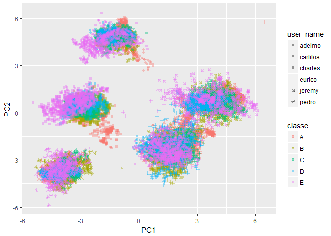

# Practical Machine Learning Coursera Class - Week 4 Assignment
Anton Biryukov  
 Sep 4 2017  
# Summary
In this exercise I attempted to classify the manner of doing a bicep curl. Specifically, we wanted to know whether accelorometer data can distinguish between the correct and incorrect exercise technique. For that purpose, a random forest model was trained on data with 5-fold cross-validation; the accuracy of the classifier was then estimated on the 25% of the original dataset hidden during training. **The accuracy estimate turned out to be around 97% with the out of sample error estimate ~3%.**


# Introduction:
In this notebook I will attempt to build a predictive model on a Weight Lifting Exercise Dataset. The dataset contains measurements from accelerometers installed on both the participant and the free weight. The participants were instructed to perform the exercise in several manners: a correct one, and five intentionally set up to be incorrect. Specifically, (as taken from the source website):

*"Six young health participants were asked to perform one set of 10 repetitions of the Unilateral Dumbbell Biceps Curl in five different fashions: exactly according to the specification (Class A), throwing the elbows to the front (Class B), lifting the dumbbell only halfway (Class C), lowering the dumbbell only halfway (Class D) and throwing the hips to the front (Class E)."*

The question the predictive model aims to answer here is as follows:
*"Is it possible to predict the manner in which the participant performs the exercise?"*

# Loading & Cleaning the dataset:
I would like to first load the dataset, and look at the fractions that each class takes in the training sample, as well as take a look whether the classes are separable in the PC1 vs PC2 domain. This will give me some idea as to what kind of class confusion I should expect.

Read the training/testing data csv-s:

```r
library(dplyr)
library(ggplot2)
library(caret)
library(GGally)
library(magrittr)

train.df <- tbl_df(read.csv('../pml-training.csv',stringsAsFactors = F,na.strings = c("","NA"))) %>% select(-X)
test.df <- tbl_df(read.csv('../pml-testing.csv',stringsAsFactors = F,na.strings = c("","NA"))) %>% select(-c(problem_id,X)) %>% mutate(classe='DUM')
print(train.df)
```

```
## # A tibble: 19,622 x 159
##    user_name raw_timestamp_part_1 raw_timestamp_part_2   cvtd_timestamp
##        <chr>                <int>                <int>            <chr>
##  1  carlitos           1323084231               788290 05/12/2011 11:23
##  2  carlitos           1323084231               808298 05/12/2011 11:23
##  3  carlitos           1323084231               820366 05/12/2011 11:23
##  4  carlitos           1323084232               120339 05/12/2011 11:23
##  5  carlitos           1323084232               196328 05/12/2011 11:23
##  6  carlitos           1323084232               304277 05/12/2011 11:23
##  7  carlitos           1323084232               368296 05/12/2011 11:23
##  8  carlitos           1323084232               440390 05/12/2011 11:23
##  9  carlitos           1323084232               484323 05/12/2011 11:23
## 10  carlitos           1323084232               484434 05/12/2011 11:23
## # ... with 19,612 more rows, and 155 more variables: new_window <chr>,
## #   num_window <int>, roll_belt <dbl>, pitch_belt <dbl>, yaw_belt <dbl>,
## #   total_accel_belt <int>, kurtosis_roll_belt <chr>,
## #   kurtosis_picth_belt <chr>, kurtosis_yaw_belt <chr>,
## #   skewness_roll_belt <chr>, skewness_roll_belt.1 <chr>,
## #   skewness_yaw_belt <chr>, max_roll_belt <dbl>, max_picth_belt <int>,
## #   max_yaw_belt <chr>, min_roll_belt <dbl>, min_pitch_belt <int>,
## #   min_yaw_belt <chr>, amplitude_roll_belt <dbl>,
## #   amplitude_pitch_belt <int>, amplitude_yaw_belt <chr>,
## #   var_total_accel_belt <dbl>, avg_roll_belt <dbl>,
## #   stddev_roll_belt <dbl>, var_roll_belt <dbl>, avg_pitch_belt <dbl>,
## #   stddev_pitch_belt <dbl>, var_pitch_belt <dbl>, avg_yaw_belt <dbl>,
## #   stddev_yaw_belt <dbl>, var_yaw_belt <dbl>, gyros_belt_x <dbl>,
## #   gyros_belt_y <dbl>, gyros_belt_z <dbl>, accel_belt_x <int>,
## #   accel_belt_y <int>, accel_belt_z <int>, magnet_belt_x <int>,
## #   magnet_belt_y <int>, magnet_belt_z <int>, roll_arm <dbl>,
## #   pitch_arm <dbl>, yaw_arm <dbl>, total_accel_arm <int>,
## #   var_accel_arm <dbl>, avg_roll_arm <dbl>, stddev_roll_arm <dbl>,
## #   var_roll_arm <dbl>, avg_pitch_arm <dbl>, stddev_pitch_arm <dbl>,
## #   var_pitch_arm <dbl>, avg_yaw_arm <dbl>, stddev_yaw_arm <dbl>,
## #   var_yaw_arm <dbl>, gyros_arm_x <dbl>, gyros_arm_y <dbl>,
## #   gyros_arm_z <dbl>, accel_arm_x <int>, accel_arm_y <int>,
## #   accel_arm_z <int>, magnet_arm_x <int>, magnet_arm_y <int>,
## #   magnet_arm_z <int>, kurtosis_roll_arm <chr>, kurtosis_picth_arm <chr>,
## #   kurtosis_yaw_arm <chr>, skewness_roll_arm <chr>,
## #   skewness_pitch_arm <chr>, skewness_yaw_arm <chr>, max_roll_arm <dbl>,
## #   max_picth_arm <dbl>, max_yaw_arm <int>, min_roll_arm <dbl>,
## #   min_pitch_arm <dbl>, min_yaw_arm <int>, amplitude_roll_arm <dbl>,
## #   amplitude_pitch_arm <dbl>, amplitude_yaw_arm <int>,
## #   roll_dumbbell <dbl>, pitch_dumbbell <dbl>, yaw_dumbbell <dbl>,
## #   kurtosis_roll_dumbbell <chr>, kurtosis_picth_dumbbell <chr>,
## #   kurtosis_yaw_dumbbell <chr>, skewness_roll_dumbbell <chr>,
## #   skewness_pitch_dumbbell <chr>, skewness_yaw_dumbbell <chr>,
## #   max_roll_dumbbell <dbl>, max_picth_dumbbell <dbl>,
## #   max_yaw_dumbbell <chr>, min_roll_dumbbell <dbl>,
## #   min_pitch_dumbbell <dbl>, min_yaw_dumbbell <chr>,
## #   amplitude_roll_dumbbell <dbl>, amplitude_pitch_dumbbell <dbl>,
## #   amplitude_yaw_dumbbell <chr>, total_accel_dumbbell <int>,
## #   var_accel_dumbbell <dbl>, avg_roll_dumbbell <dbl>,
## #   stddev_roll_dumbbell <dbl>, ...
```

```r
table(train.df$classe)
```

```
## 
##    A    B    C    D    E 
## 5580 3797 3422 3216 3607
```
Class distribution is skewed towards the "correct manner of exercise", but otherwise is not very imbalanced. Therefore, I will restrain from applying any class balance corrections. It also seems meaningful to drop the time-date related predictors out of the dataset - the manner to be guessed in the future (test) set should not depend on when the exercise was performed. I would also want to Looks like a few columns have a lot of NA in them, let's see if I can drop those with zero variance:

```r
nz.ind <- caret::nearZeroVar(train.df,saveMetrics = F)
nz.metrics <- caret::nearZeroVar(train.df,saveMetrics = T)
```

Now, I'll also drop all the columns where the percentage of NAs is >95%:

```r
library(dplyr) # knitr is being annoying

fracNA <- (colMeans(is.na(train.df)) > 0.95)
keepCol <- names(train.df)[!fracNA]

train.df.nz <- tbl_df(train.df[,-nz.ind ]) %>% select(-starts_with("raw_timestamp"),-cvtd_timestamp,-num_window) %>% select(one_of(keepCol))
```

```
## Warning: Unknown variables: `raw_timestamp_part_1`, `raw_timestamp_part_2`,
## `cvtd_timestamp`, `new_window`, `num_window`
```

```r
test.df.nz <- tbl_df(test.df[,-nz.ind]) %>% select(-starts_with("raw_timestamp"),-cvtd_timestamp,-num_window) %>% select(one_of(keepCol))
```

```
## Warning: Unknown variables: `raw_timestamp_part_1`, `raw_timestamp_part_2`,
## `cvtd_timestamp`, `new_window`, `num_window`
```

```r
print(train.df.nz)
```

```
## # A tibble: 19,622 x 54
##    user_name roll_belt pitch_belt yaw_belt total_accel_belt gyros_belt_x
##        <chr>     <dbl>      <dbl>    <dbl>            <int>        <dbl>
##  1  carlitos      1.41       8.07    -94.4                3         0.00
##  2  carlitos      1.41       8.07    -94.4                3         0.02
##  3  carlitos      1.42       8.07    -94.4                3         0.00
##  4  carlitos      1.48       8.05    -94.4                3         0.02
##  5  carlitos      1.48       8.07    -94.4                3         0.02
##  6  carlitos      1.45       8.06    -94.4                3         0.02
##  7  carlitos      1.42       8.09    -94.4                3         0.02
##  8  carlitos      1.42       8.13    -94.4                3         0.02
##  9  carlitos      1.43       8.16    -94.4                3         0.02
## 10  carlitos      1.45       8.17    -94.4                3         0.03
## # ... with 19,612 more rows, and 48 more variables: gyros_belt_y <dbl>,
## #   gyros_belt_z <dbl>, accel_belt_x <int>, accel_belt_y <int>,
## #   accel_belt_z <int>, magnet_belt_x <int>, magnet_belt_y <int>,
## #   magnet_belt_z <int>, roll_arm <dbl>, pitch_arm <dbl>, yaw_arm <dbl>,
## #   total_accel_arm <int>, gyros_arm_x <dbl>, gyros_arm_y <dbl>,
## #   gyros_arm_z <dbl>, accel_arm_x <int>, accel_arm_y <int>,
## #   accel_arm_z <int>, magnet_arm_x <int>, magnet_arm_y <int>,
## #   magnet_arm_z <int>, roll_dumbbell <dbl>, pitch_dumbbell <dbl>,
## #   yaw_dumbbell <dbl>, total_accel_dumbbell <int>,
## #   gyros_dumbbell_x <dbl>, gyros_dumbbell_y <dbl>,
## #   gyros_dumbbell_z <dbl>, accel_dumbbell_x <int>,
## #   accel_dumbbell_y <int>, accel_dumbbell_z <int>,
## #   magnet_dumbbell_x <int>, magnet_dumbbell_y <int>,
## #   magnet_dumbbell_z <dbl>, roll_forearm <dbl>, pitch_forearm <dbl>,
## #   yaw_forearm <dbl>, total_accel_forearm <int>, gyros_forearm_x <dbl>,
## #   gyros_forearm_y <dbl>, gyros_forearm_z <dbl>, accel_forearm_x <int>,
## #   accel_forearm_y <int>, accel_forearm_z <int>, magnet_forearm_x <int>,
## #   magnet_forearm_y <dbl>, magnet_forearm_z <dbl>, classe <chr>
```

# Exploratory analysis

Ok, so a few columns are thrown out from both train and test now for the consistency. Let's look at the data in the PC space:

```r
library(caret)
pcObj <- preProcess(train.df.nz,method="pca",thresh=0.98)
train.pc <- predict(pcObj,train.df.nz)
#ggplot(data=train.pc,aes(x=PC1,y=PC2,col=user_name,alpha=user_name)) + geom_point()
ggplot(data=train.pc,aes(x=PC1,y=PC2,col=classe,shape=user_name)) + geom_point(alpha=0.4)
```

<!-- -->

```r
print(pcObj)
```

```
## Created from 19622 samples and 54 variables
## 
## Pre-processing:
##   - centered (52)
##   - ignored (2)
##   - principal component signal extraction (52)
##   - scaled (52)
## 
## PCA needed 31 components to capture 98 percent of the variance
```

A few conclusions can be drawn straight from here:
- A lot of columns remained after PCA - the problem can be fairly complex
- The first two components do not show any evident class separation
- Class separation varies among the users, thus user_name might be one of the top important predictors

Given that:
- the classification trees and random forests built of CARTs seem to be performing fairly well for many datasets,
- the model selection is out of scope of this project
I decided to pick randomForest as the classifier for this problem, as ensemble methods built on top of simple (weak) predictors tend to significantly boost their performance. I also would like to keep a part of the training test hidden from the training procedure ("out-of-sample data"), with a train-test split of 75% - 25%, respectively.

For the sake of speed of computation and the fact that a lot of points show significant overlap (e.g. little information added), I would like to "trim" the data here a little bit by downsampling.

Cross-validation will be done with 5-fold method, and we will evaluate the out of sample accuracy on that hidden set.

# Training the classifier

Therefore, below I would like to see how random forest performs for this problem:


```r
# Downsampling here
ind.ds <- sample(nrow(train.df.nz),size = round(nrow(train.df.nz)/5) )
train.df.nz.ds <- train.df.nz[ind.ds,]
# Partition the dataset
train.inds <- createDataPartition(train.df.nz.ds$classe,p=0.75,list = F)
rf.train <- train.df.nz.ds[train.inds,] %>% mutate(classe = as.factor(classe),user_name = as.factor(user_name))
rf.test <- train.df.nz.ds[-train.inds,] %>% mutate(classe = as.factor(classe),user_name = as.factor(user_name))

# Finally train the RF
ctrl <- trainControl(method="cv",number = 5,classProbs = T,verboseIter = T)
rf.model <- caret::train(classe ~ . ,method='rf',tuneLength=5,trControl  =ctrl,verbose=T,data = rf.train)
```

```
## Loading required package: randomForest
```

```
## randomForest 4.6-12
```

```
## Type rfNews() to see new features/changes/bug fixes.
```

```
## 
## Attaching package: 'randomForest'
```

```
## The following object is masked from 'package:ggplot2':
## 
##     margin
```

```
## The following object is masked from 'package:dplyr':
## 
##     combine
```

```
## + Fold1: mtry= 2 
## - Fold1: mtry= 2 
## + Fold1: mtry=15 
## - Fold1: mtry=15 
## + Fold1: mtry=29 
## - Fold1: mtry=29 
## + Fold1: mtry=43 
## - Fold1: mtry=43 
## + Fold1: mtry=57 
## - Fold1: mtry=57 
## + Fold2: mtry= 2 
## - Fold2: mtry= 2 
## + Fold2: mtry=15 
## - Fold2: mtry=15 
## + Fold2: mtry=29 
## - Fold2: mtry=29 
## + Fold2: mtry=43 
## - Fold2: mtry=43 
## + Fold2: mtry=57 
## - Fold2: mtry=57 
## + Fold3: mtry= 2 
## - Fold3: mtry= 2 
## + Fold3: mtry=15 
## - Fold3: mtry=15 
## + Fold3: mtry=29 
## - Fold3: mtry=29 
## + Fold3: mtry=43 
## - Fold3: mtry=43 
## + Fold3: mtry=57 
## - Fold3: mtry=57 
## + Fold4: mtry= 2 
## - Fold4: mtry= 2 
## + Fold4: mtry=15 
## - Fold4: mtry=15 
## + Fold4: mtry=29 
## - Fold4: mtry=29 
## + Fold4: mtry=43 
## - Fold4: mtry=43 
## + Fold4: mtry=57 
## - Fold4: mtry=57 
## + Fold5: mtry= 2 
## - Fold5: mtry= 2 
## + Fold5: mtry=15 
## - Fold5: mtry=15 
## + Fold5: mtry=29 
## - Fold5: mtry=29 
## + Fold5: mtry=43 
## - Fold5: mtry=43 
## + Fold5: mtry=57 
## - Fold5: mtry=57 
## Aggregating results
## Selecting tuning parameters
## Fitting mtry = 29 on full training set
```

Let's now test the predictions:


```r
class.test <- predict(rf.model,rf.test)
message(sprintf("Accuracy on test = %3.2f",mean(class.test == rf.test$classe)))
```

```
## Accuracy on test = 0.97
```

```r
class.real.test <-predict(rf.model,test.df.nz) 
# For the final quiz, predictions here:
print(test.df.nz %>% mutate(classe = class.real.test))
```

```
## # A tibble: 20 x 54
##    user_name roll_belt pitch_belt yaw_belt total_accel_belt gyros_belt_x
##        <chr>     <dbl>      <dbl>    <dbl>            <int>        <dbl>
##  1     pedro    123.00      27.00    -4.75               20        -0.50
##  2    jeremy      1.02       4.87   -88.90                4        -0.06
##  3    jeremy      0.87       1.82   -88.50                5         0.05
##  4    adelmo    125.00     -41.60   162.00               17         0.11
##  5    eurico      1.35       3.33   -88.60                3         0.03
##  6    jeremy     -5.92       1.59   -87.70                4         0.10
##  7    jeremy      1.20       4.44   -87.30                4        -0.06
##  8    jeremy      0.43       4.15   -88.50                4        -0.18
##  9  carlitos      0.93       6.72   -93.70                4         0.10
## 10   charles    114.00      22.40   -13.10               18         0.14
## 11  carlitos      0.92       5.94   -92.70                3         0.05
## 12    jeremy      1.01       4.96   -87.80                5        -0.10
## 13    eurico      0.54       2.45   -88.60                3        -0.06
## 14    jeremy      0.45       5.02   -87.90                5        -0.05
## 15    jeremy      5.34      -3.09   -80.30                4         0.24
## 16    eurico      1.65       3.47   -87.00                2         0.02
## 17     pedro    129.00      27.80     1.84               21        -0.50
## 18  carlitos      0.92       5.31   -93.10                3         0.02
## 19     pedro    123.00      26.70    -2.68               19        -0.31
## 20    eurico      1.40       3.20   -88.70                3         0.06
## # ... with 48 more variables: gyros_belt_y <dbl>, gyros_belt_z <dbl>,
## #   accel_belt_x <int>, accel_belt_y <int>, accel_belt_z <int>,
## #   magnet_belt_x <int>, magnet_belt_y <int>, magnet_belt_z <int>,
## #   roll_arm <dbl>, pitch_arm <dbl>, yaw_arm <dbl>, total_accel_arm <int>,
## #   gyros_arm_x <dbl>, gyros_arm_y <dbl>, gyros_arm_z <dbl>,
## #   accel_arm_x <int>, accel_arm_y <int>, accel_arm_z <int>,
## #   magnet_arm_x <int>, magnet_arm_y <int>, magnet_arm_z <int>,
## #   roll_dumbbell <dbl>, pitch_dumbbell <dbl>, yaw_dumbbell <dbl>,
## #   total_accel_dumbbell <int>, gyros_dumbbell_x <dbl>,
## #   gyros_dumbbell_y <dbl>, gyros_dumbbell_z <dbl>,
## #   accel_dumbbell_x <int>, accel_dumbbell_y <int>,
## #   accel_dumbbell_z <int>, magnet_dumbbell_x <int>,
## #   magnet_dumbbell_y <int>, magnet_dumbbell_z <int>, roll_forearm <dbl>,
## #   pitch_forearm <dbl>, yaw_forearm <dbl>, total_accel_forearm <int>,
## #   gyros_forearm_x <dbl>, gyros_forearm_y <dbl>, gyros_forearm_z <dbl>,
## #   accel_forearm_x <int>, accel_forearm_y <int>, accel_forearm_z <int>,
## #   magnet_forearm_x <int>, magnet_forearm_y <int>,
## #   magnet_forearm_z <int>, classe <fctr>
```

This set of predictions actually have me 20/20 points correct for the final quiz, so I guess the **accuracy estimate of 97% (i.e. out-of-sample error ~ 3%) on the "test" set** from the training is fairly accurate.

# Importance plot
Finally, I ll show the importance plot:

```r
varImpPlot(rf.model$finalModel)
```

<!-- -->

The plot makes sense if you read carefully what kind of motion character corresponded to each manner and if you're familiar with the exercise itself. Although, it seems quite intersting that user_name is not one of the top importance variables..


